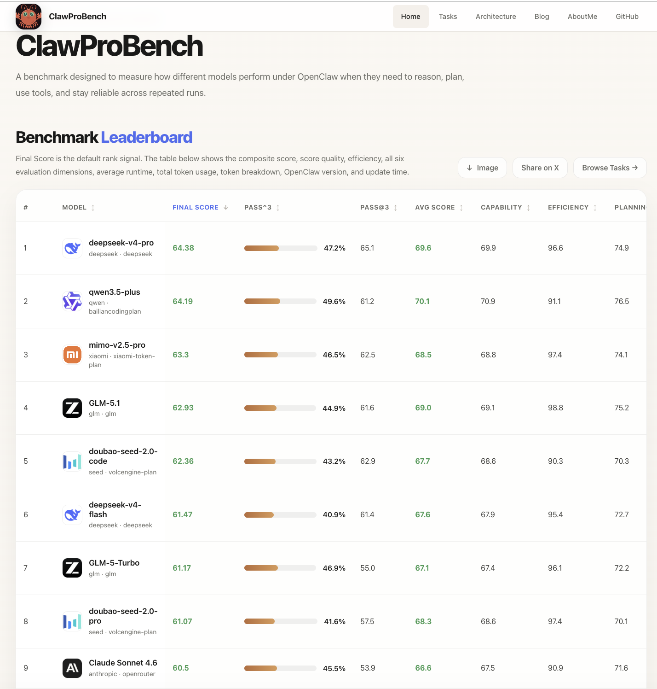
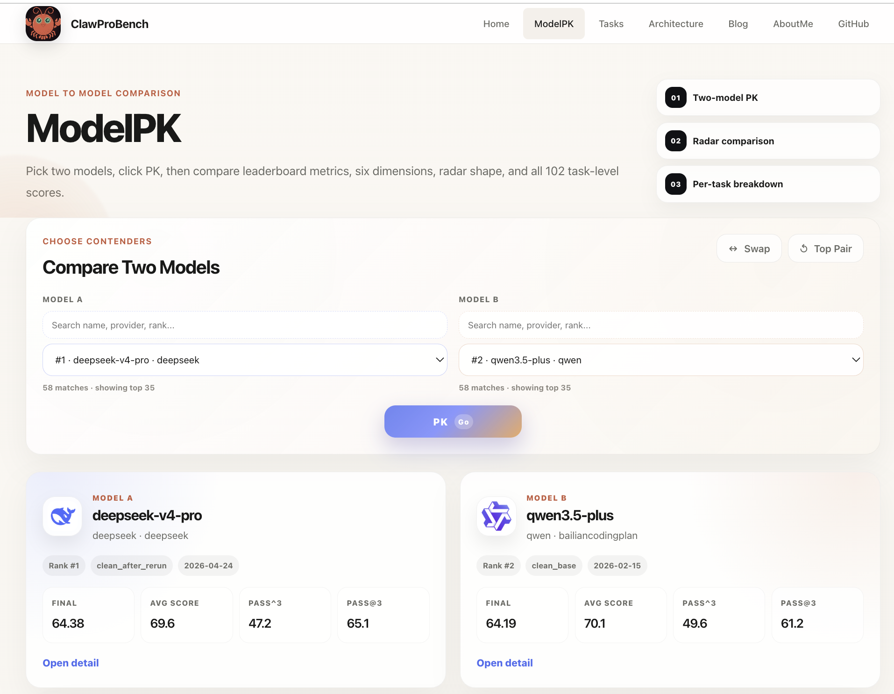

<div align="center">


# ClawProBench

[](https://arxiv.org/abs/2608.22510)
[](#基准配置)
[](#基准配置)
[](#基准配置)
[](#快速开始)
[](LICENSE)

> 面向 OpenClaw 真实运行时的透明 live-first 模型能力评测框架。<br>
> 102 个活跃场景，164 个目录场景，确定性评分，并原生覆盖 OpenClaw 工作流。<br>
> 论文已发布于 arXiv：[ClawProBench: Trace-Aware Evaluation of AI Agents with Runtime Coverage and Frozen Workplace-Style Holdouts](https://arxiv.org/abs/2608.22510)。

</div>

<p>
  <a href="README.md"><strong>English README</strong></a>
</p>

ClawProBench 专注于真实 OpenClaw 执行，提供确定性评分、结构化报告和基准配置选择。默认排名路径是 `core` 配置；更广的活跃覆盖仍可通过 `intelligence`、`coverage`、`native` 和 `full` 使用。

当前工作区清单通过 `python3 run.py inventory --json` 和 `python3 run.py inventory --benchmark-status all --json` 统计到 `102` 个活跃场景和 `164` 个总目录场景，其中 `62` 个为 incubating 状态。

## 排行榜

公开排行榜和基准任务可在 **[suyoumo.github.io/bench](https://suyoumo.github.io/bench/)** 浏览。

[](https://suyoumo.github.io/bench/)

[](https://suyoumo.github.io/bench/modelpk/)

## 参与和联系

我们诚挚感谢 Kimi 和 Qwen 的朋友们对 ClawProBench 排行榜提出的反馈和改进建议。

也感谢 LongCat、Kimi、蚂蚁 Ling 和 MiMo 提供模型访问支持、试用资源或平台资源。这些支持降低了评测成本，使我们能够在透明的真实运行时设置中覆盖更多前沿模型和预览模型。

如果国内第三方 API 网关服务商希望其提供的模型，例如 Claude 4.7 Opus 或 GPT-5.5，出现在排行榜中，欢迎联系我们。在评测设置稳定后，我们可以运行 benchmark 并发布可复现结果。

运行 ClawProBench、提交结果或讨论排行榜模型评测，请联系：xyh920691910@outlook.com。

## LLMLeadBoard

LLMLeadBoard 是与 ClawProBench 同属一个 leaderboard family 的报告来源模型分数榜单。它按模型和推理模式汇总公开模型报告中的 benchmark 分数，方便横向比较不同模型报告中的能力信号。

当前 LLMLeadBoard 包含 `63` 个模型、来自 `55` 份模型报告，囊括 `444` 个 benchmark。榜单支持 benchmark 筛选；当同一模型在同一 benchmark 上来自不同报告且分数不一致时，会在同一个格子中堆叠展示多个分数；同时支持查看同一模型家族在某个 benchmark 上的进步趋势图，以及模型迭代速度图。

## 博客

- [ClawProBench Close DataSet LeadBoard Release：ClawProBench Closed Dataset Release and Analysis](https://suyoumo.github.io/bench/blog/2026-05-19-closed-dataset-release-analysis/)
- [Safety Under Live Agent Work: What the ClawProBench Leaderboard Shows](https://suyoumo.github.io/bench/blog/2026-04-30-model-safety-analysis/)
- [My Feelings During the Development of ClawProBench](https://suyoumo.github.io/bench/blog/2026-04-02-why-pass3-matters/)
- [Open-sourcing ClawProBench: Bringing Agent Benchmarks Back to the Real Runtime](https://suyoumo.github.io/bench/blog/2026-04-02-openclawprobench-launch/)

## 📢 更新

- `v2.0.3` - ClawProBench 论文已发布至 arXiv（[2608.22510](https://arxiv.org/abs/2608.22510)），引用信息已同步更新；新增 `kimi-k3` 榜单分数；同步 harness 代码更新（resume 模型别名保留修复）；使用确定性乱序不敏感匹配器加固了多个自定义 checker；并入 IronClaw 与 NanoClaw harness 源码，支持跨 harness 评估。
- `v2.0.2` - ClawProBench 开源数据集和闭源数据集均新增 `agnes-2.0-flash` 的结果。CodeAgentBench 新增 `GLM-5.2`、`Qwen3.7-Max`、`Qwen3.7-Plus`、`MiniMax-M3` 和 `step-3.7-flash` 的结果。
- `v2.0.1` - 闭源数据集新增 `Qwen3.7-Max`、`Gemini 3.1 Pro`、`MiniMax-M3` 和 `step-3.7-flash` 的分数；开源数据集新增 `MiniMax-M3` 和 `step-3.7-flash` 的分数；并新增 LLMLeadBoard 介绍区块，用于说明这个基于公开模型报告汇总 benchmark 分数的榜单。
- `v2.0.0` - 新增闭源榜单，发布 `33` 个模型的闭源数据集结果；支持点击闭源榜单模型查看模型详情，支持闭源榜单可视化图表查看，并支持在 `Tasks` 中查看闭源数据集任务。
- `v1.1.6` - 开源模型榜单新增上海 AI Lab `intern-s2-preview`。
- `v1.1.5` - 新增 `ring-2.6-1T-xhigh` 的排行榜结果；排行榜现在共有 `65` 个模型。
- `v1.1.4` - 新增百度 `ERNIE 5.1` 和商汤 `Sensenova 6.7 Flash Lite` 的排行榜结果。（很高兴看到 ClawProBench 受到越来越多的关注。由于 benchmark 完全开源，无法完全避免模型厂商针对公开 benchmark 做定向分数优化；基于 ClawProBench 闭源数据集的排行榜将很快发布。我的代码 benchmark 的开源数据集部分和评估 harness 也预计会在未来 1-2 周内开源，敬请期待。）
- `v1.1.3` - 新增 OpenAI `gpt-5.5`、`gpt-5.4` 和 `gpt-5.3-codex` 的排行榜结果，当前排名第 1-3；同时新增 `DeepSeek-R1` 和 `kimi-for-coding-k2.6`，并同步最新的真实运行时、自定义检查加载和场景评分修复。
- `v1.1.2` - 新增 `qwen3.5-397b-a17b` 的排行榜数据，修复多个模型的价格和发布日期元数据，并新增 ModelPK 用于详细模型对比。
- `v1.1.1` - 新增 `kimi-k2.6` 的排行榜结果；排行榜现在包含 `57` 个模型。
- `v1.1.0` - 新增 `qwen3.6-27b`、`qwen3.6-35b-a3b` 和 `qwen3.6-flash` 的排行榜结果。
- `v1.0.9` - 校验了排行榜中模型详情数据，修复多处数据错误，新增 `DeepSeeK-V4-Pro`、`DeepSeek-V4-Flash`、`LongCat-2.0-Preview` 和 `Ling-2.6-1T`，并引入基于 `pass^3`、`pass@3` 和 `average_score` 的新 `FinalScore` 指标。
- `v1.0.8` - 新增 6 个排行榜模型：`qwen3.6-max-preview`、`mimo-v2.5`、`mimo-v2.5-pro`、`hunyuan-t1`、`hy3-preview` 和 `Ling-2.6-Flash`。
- `v1.0.7` - 同步最新 harness 线中的 benchmark 修复，包括 `--exclude-scenario` 过滤、隔离 live-run 运行时加固，以及自定义评分 trace 参数兼容性修复。
- `v1.0.6` - 修复使用鼠标拖动横向滚动条时可能出现的排行榜粘性表头同步问题。新增 `qwen3.6-plus` Token Plan 结果。
- `v1.0.5` - 修复 `qwen3.6-plus` 模型详情中 Bailian 和 Qwen Coding Plan 条目错误显示重复任务分数的问题。
- `v1.0.4` - 修复隔离 live-run 日志污染导致的误判执行失败。新增 `kimi-k2.6-code-preview`；排行榜现在包含 `43` 个模型结果。
- `v1.0.3` - 审核 40 多个 benchmark 模型的排行榜、详情页和原始结果一致性；修复 `doubao-seed-code`、`qwen3.6-plus`、`qwen3-max-2026-01-23`、`astron-code-latest` 和 `ERNIE-4.5-Turbo` 的已确认数据不一致。
- `v1.0.2` - 新增 `kimi-for-coding`、`gemma4-31b` 和 `kimi-k2-thinking`；改进图片下载流程，便于移动端浏览。
- `v1.0.1` - 新增 `qwen3-coder-next`、`doubao-seed-code`、`qwen3-max-2026-01-23` 和使用 `bailiancodingplan` 重新运行的 `qwen3.6plus`；新增模型图片下载和 benchmark 分享到 Twitter；修复 completed report resume 覆盖、`tool_use_14` skills inventory 加载失败时的优雅降级、`tool_use_17` 无效 JSON 与缺失文件容错，以及 `audit_scenario_quality.py` 兼容性。
- `v1.0.0` - ClawProBench 发布，包含跨 6 个领域的 102 个任务，支持 3-try 运行、checkpoint resume 和跨环境 resume。

## 评估逻辑

- 默认排名路径：`core`
- 扩展活跃能力套件：`intelligence`
- 仅 OpenClaw 原生任务切片：`native`
- 通过 `--trials N` 支持多轮试验
- 核心排行榜指标包括 `pass^3`、`pass@3`、`average_score` 和 `FinalScore`
- `FinalScore = 100 × S^0.40 × r_all^0.45 × r_any^0.15`，其中 `S = average_score`，`r_all = (pass^3)^(1/3)`，`r_any = 1 - (1 - pass@3)^(1/3)`
- 该设计主要强调稳定的重复成功，同时保留整体质量和 best-of-3 上限表现
- 报告会公开 `avg_score`、`max_score`、覆盖率感知摘要、成本、延迟和 resume 元数据
- 中断运行可通过 `--continue` 或 `--resume-from` 继续，执行失败可通过 `--rerun-execution-failures` 重新入队

## 快速开始

推荐使用 [uv](https://docs.astral.sh/uv/) 快速、可靠地搭建 Python 环境：

```bash
pip install uv
uv venv --python 3.11
source .venv/bin/activate
uv pip install -r requirements.txt
```

运行 benchmark 前，请确认本地 OpenClaw 运行时可用：

```bash
openclaw --help
openclaw agents list --json
```

检查 benchmark 目录并验证场景集合：

```bash
python3 run.py inventory
python3 run.py inventory --json
python3 run.py dry
```

在默认排名 benchmark 上运行单轮 smoke：

```bash
python3 run.py run \
  --model '<MODEL>' \
  --execution-mode live \
  --benchmark-profile core \
  --trials 1 \
  --cleanup-agents
```

运行完整默认 benchmark：

```bash
python3 run.py run \
  --model '<MODEL>' \
  --execution-mode live \
  --benchmark-profile core \
  --trials 3 \
  --cleanup-agents
```

比较生成的报告：

```bash
python3 run.py compare --results-dir results
```

对于同一主机上的隔离运行，harness 还支持：

- `--openclaw-profile`
- `--openclaw-state-dir`
- `--openclaw-config-path`
- `--openclaw-gateway-port`
- `--openclaw-binary`

## 基准配置

| 配置 | 活跃场景 | 用途 |
| --- | ---: | --- |
| `core` | 26 | 默认排名套件 |
| `intelligence` | 95 | 扩展活跃能力 benchmark |
| `coverage` | 7 | 较低风险的广度和回归切片 |
| `native` | 36 | 仅活跃 OpenClaw 原生任务切片 |
| `full` | 102 | 所有活跃场景的并集 |

benchmark 目录还包含 `62` 个 incubating 场景，可通过 `--benchmark-status all` 查看。

## OpenClaw 运行时

Live run 需要可用的本地 `openclaw` CLI，以及所选场景涉及到的鉴权和配置。如果二进制文件不在 `PATH` 中，请设置 `OPENCLAW_BINARY` 或传入 `--openclaw-binary`。

`config/openclaw.json.template` 提供了本地 OpenClaw 配置和隔离运行设置的参考模板。

## 仓库结构

- `run.py`：`inventory`、`dry`、`run` 和 `compare` 的 CLI 入口
- `harness/`：加载器、运行器、评分、报告和 OpenClaw live bridge
- `scenarios/`：YAML 格式的 benchmark 任务
- `datasets/`：带种子的 live-task 数据和可选 setup / teardown 脚本
- `custom_checks/`：场景专用评分逻辑
- `tests/`：加载器、运行器、评分和报告的回归测试
- `docs/`：公开资产、评估验证和 benchmark-profile 策略

## 生成输出

Benchmark 报告会写入 `results/`。这些是运行时生成产物，在当前仓库结构中会被版本控制有意忽略。

## 引用

如果你在研究中使用 ClawProBench，请引用：

```bibtex
@misc{clawprobench2026,
  title={ClawProBench: Trace-Aware Evaluation of AI Agents with Runtime Coverage and Frozen Workplace-Style Holdouts},
  author={Xiao, YuanHang},
  year={2026},
  eprint={2608.22510},
  archivePrefix={arXiv},
  primaryClass={cs.AI},
  url={https://arxiv.org/abs/2608.22510},
  doi={10.48550/arXiv.2608.22510}
}
```

## 贡献

欢迎提交 issue、文档修复、场景改进、评分器加固和 benchmark engine 贡献。设置和验证指南请参见 `CONTRIBUTING.md`。

## 致谢

本项目受到了智能体评测、benchmark 设计和真实任务评估方向多个开源工作的启发。

我们借鉴了 PinchBench、Claw-Eval、AgencyBench 以及相关 agent-benchmark 项目的思路，尤其是在任务设计、评估方法、harness 结构和公开 benchmark 呈现方面。

本仓库中的部分任务由早期公开 benchmark 风格任务集改编并重构，以适配 OpenClaw 运行时和评分框架。
